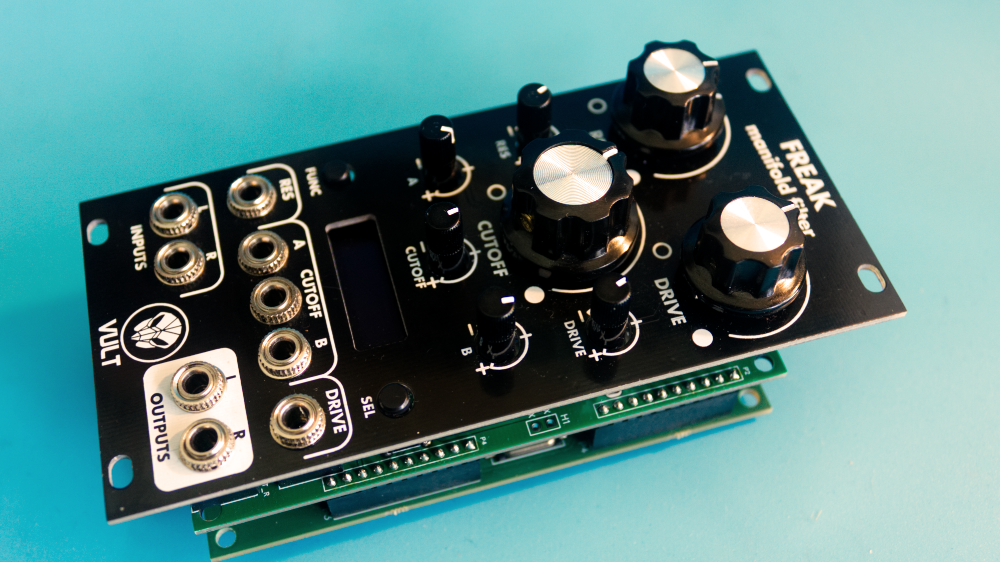

# Vult Freak Firmware
Release notes for the Vult Freak Filter

# Release v3.1
- Fixes screen initialization problem

# Release v3.0
- Adds Duplex mode
- Adds Nitrous
- Adds Wolv
- Allows to mix all the modulation signals with the SUMMED mode
- Reduces the noise by turning off the HP filter of the CODEC
- Integrates a screensaver based on the Wolfram cellular automata
- Many internal improvements and fixes

# Release v2.5
- Models: Adds Boomstick HP
- Models: Adds Nurage-VCA (LPG + VCA) mode with variable vactrol “decay”
- Models: Adds vactrols with different “decay” for Nurage
- Models: Adds Phonok, a vowel resonator
- Avoids pops when changing filters and models
- Makes easier to press both buttons
- Implements long press to go one filter back
- Many optimisations to avoid hanging the module
- Settings are previewed while changing them
- Setting: modulation input ranges
- Setting: audio output levels
- Setting: stereo modulations
- Setting: output mix

# Release v2.4
- Adds builtin VCAs

# Release v2.3
- Adds two distortion models of Flame
- Adds extra modes to Disjoint (96dB)

# Release v2.2
- Fixes instabilities in Tangents-XX
- Fixes slowdown of the module that occurs in some edge cases
- Improves the Notch mode of Ferox

# Release v2.1
- Adds Disjoint filter
- Adds Nopskate octaver

# Release v2.0
 - [x] Add dual filter mode.
 - Adds Debriatus distortion
 - Adds Boomstick filter

# Release v1.0
- [x] Saving the current filter configuration and restore it after boot.

# Release v0.1

This version includes the following filter models:
- Tangents-YU
- Tangents-MS
- Tangents-XX
- Lateralus
- Nurage
- Ferox
- Vortex
- Unstabile
- Stabile
- Rescomb
- Vorg

At this stage the settings are not saved. After every restart the module will be running the initial filter.

Routing of the inputs A and B is mapped to channels Left and Right correspondingly.

# Future Features

- [ ] Adding more routing options for A and B inputs.
- [ ] Adding calibration menu to define the actual positions of the knobs and input voltages.

# License

The Freak firmware is property of Leonardo Laguna Ruiz. All rights reserved. Owners of a Vult Freak Hardware module are granted a license to run it in their Vult Freak Hardware. Any other use is not allowed by this license.

This project uses the following third-party sources:

- The Freak Bootloader is a modified version the bootloader code, Copyright 2014 Emilie Gillet released under MIT license.
- Lua VM is included, Copyright 1994–2019 Lua.org, PUC-Rio released under MIT license.
